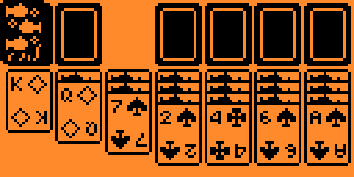
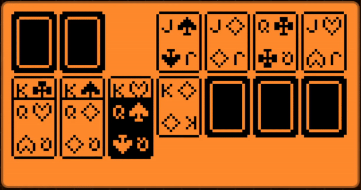

# Solitaire - Klondike for Flipper Zero

## Features

* **Auto-Solve:** Ability to automatically solve the game when all cards are flipped.
* **Animated Card Movements:** Animated transitions during solve and deal.
* **Time Tracking:** Displays the time it took to solve at the end of each game.
* **Falling Cards:** Enjoy a visually satisfying cascade of cards when you win.

## Shortcuts

* **Long Press Any Arrow:** Jump to the furthest point in that direction.
* **Long Press Center:** Automatically place the card in the top right section.
* **Long Press Back:** Close the application instantly.

## Rules
- **Empty Tableau Spots:** Only a King can be placed in an empty tableau spot.
- **Tableau Arrangement:** Cards must be arranged in descending order and alternating colors (e.g., red ten on black nine) within the tableau.
- **Empty Foundation Piles:** Only an Ace can be placed in an empty foundation pile.
- **Foundation Pile Arrangement:** Cards must be in ascending order and in the same suit.

## How to Play

- Use the directional arrows to navigate and move cards.
- Pick up cards with the center button.
- Aim to build up four foundation piles in ascending order, separated by suit.
- Flip and move cards within the tableau to reveal hidden cards.
- You can place back cards in the same spot you picked them up.

## Building
> The app should be compatible with the official and custom flipper firmwares. If not, follow these steps to build it
> yourself
* Set up [uFBT](https://pypi.org/project/ufbt/) if you haven't already
* Navigate into the folder of the game
* Run `ufbt`
* the finished build will be in the dist folder, copy this the fap file into your SD card
